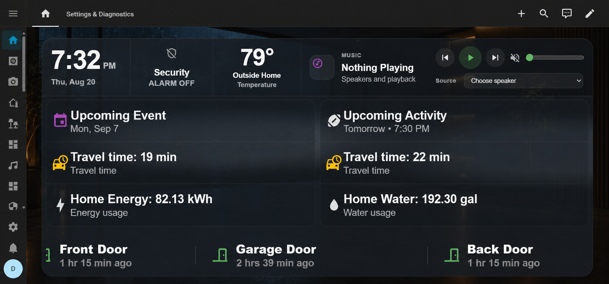
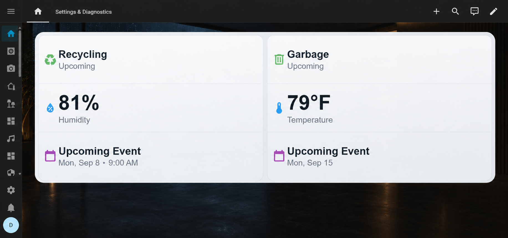

# Home Status

**A notification and awareness platform for Home Assistant — a Notification Center for your home.**

Home Status turns the signals already in Home Assistant into one calm, glanceable view: what needs attention now, what just changed, and what is coming up next. It complements the dashboards you use for control; Home Status helps everyone understand the home at a glance.


*Home Status brings live information, recent activity, and optional Visual Center media into one tablet-first Notification Center.*


*Dark theme with Visual Center enabled.*

## What Home Status shows

Home Status organizes household information into four presentation streams. You choose what it can monitor; Home Status normalizes and prioritizes that information for the card.

### NOW

The live state of the home: open doors and windows, security conditions, running appliances, weather and climate readings, and other actionable information. NOW favors the things that benefit from being visible right away.

### RECENT

Useful changes that just happened. Home Status uses eligible Recorder-backed state history for recent activity, so a closed door, completed appliance cycle, or resolved condition can remain visible after it stops being current. Related door and window closures are grouped into readable household events instead of filling the ticker with duplicates.

### AWARENESS

Context for the day ahead: household presence, weather, traffic, waste and irrigation, calendars and events, news, and other configured information. Home Status supports generic information sources rather than assuming a fixed set of integrations.

### VISUAL

When enabled and relevant content is available, the optional **Visual Center** uses the middle of the card for a camera, feed image, or supported video. It returns to the normal layout when no visual is active. Images, Home Assistant cameras, RSS/Atom feed images, and direct HTTPS HLS (.m3u8) sources are supported according to their configured source and priority.

## A card that fits the dashboard

Home Status works as a large wall-tablet Notification Center, a normal dashboard card, or a compact activity ticker.

### Left and right lanes

The main card has independently configurable left and right lanes. Choose between two display styles:

- **Slots** — three physical rows per visible lane. Active items claim stable rows; remaining information flows through the available rows.
- **Single** — the original one-item-per-side presentation, with a lightweight rotating item in each lane.

In slot mode, natural-flow sizing lets a lane grow into the available space rather than forcing every item into the same shape. The result is an easy-to-scan list that still makes room for high-priority information.


*Expanded multi-item lanes keep several useful signals readable at once.*

### Bottom ticker and display modes

The bottom ticker keeps RECENT and selected awareness information moving without consuming main-lane space. It is useful for door and window activity, appliance completions, calendar context, and other continuing updates.

Turn off both main lanes while keeping the bottom area enabled to use Home Status as a compact **ticker-only** card. This is ideal for a narrow dashboard region or a persistent activity strip.


*Ticker-only mode keeps household activity available in a minimal footprint.*

### Themes and Visual Center flexibility

Choose **Dark**, **Light**, or **Auto** appearance. Auto follows Home Assistant's light/dark setting. Visual Center can be enabled globally in the integration and independently allowed or hidden on a card. When no Visual Center is active, the main areas remain balanced rather than leaving an empty middle column.

| Dark, no Visual Center | Light, no Visual Center |
| --- | --- |
|  |  |
| *Balanced information lanes in dark appearance.* | *The same flexible layout in light appearance.* |

## Information Home Status can surface

The guided setup can monitor individual entities for precise control or whole devices when related sensors should be understood together. For example, whole washer, dryer, and dishwasher devices can yield a running state, remaining time or phase when provided, recognized faults, and a useful completion event. Supporting controls and telemetry are not promoted as household notifications.

Information sources are discovered from the entities available in your Home Assistant installation. Depending on what you have installed and choose to add, that can include:

- weather, indoor climate, and weather effects;
- calendars, all-day events, scheduled collections, irrigation, and other upcoming information;
- people, zones, household presence, and traffic/travel-time sources;
- utility and other explicitly marked Home Status source sensors;
- RSS/Atom news feeds, with an optional feed-provided image in Visual Center;
- camera visual sources and direct HTTPS HLS Live News sources; and
- generalized ESPN Sports Ticker sources across the published ESPN leagues.

ESPN sources are selected as information sources just like other supported Home Assistant entities. Home Status does not require a particular dashboard card or a hard-coded league-specific setup.

## Install with HACS

1. In HACS, add https://github.com/biggiebytes/home-status as an **Integration** repository.
2. Download **Home Status** and restart Home Assistant.
3. Open **Settings → Devices & services → Add integration**.
4. Search for **Home Status** and complete the guided setup.
5. Add **Home Status** from the dashboard card picker.

The integration includes the card, visual editor, and frontend resource. No separate Lovelace resource or copy to /config/www is required.

### Manual installation

Copy custom_components/home_status to /config/custom_components/, restart Home Assistant, then add **Home Status** from **Settings → Devices & services**. The card registers automatically.

Start with the card picker or this minimal configuration:

```yaml
type: custom:home-status-card
entity: sensor.home_status
profile: auto
```

## Setup: data and behavior

Configure the integration from **Settings → Devices & services → Home Status → Configure**. These settings control what Home Status knows about and how it prepares the notification streams; they are not simply visual card settings.

### Choose what to monitor

Use the setup flow to add individual entities, whole devices, and discovered information sources. Choose an individual entity when you need exact control; choose a device when its related entities form one useful household story. You can revisit these choices at any time.

### Manage information and visual sources

The **Information sources** area manages non-device sources such as weather, calendars, location, traffic, utility sources, and supported sports sources. News and Live News are configured separately:

- **News sources** accept generic RSS/Atom feed URLs. Feed images are used only when the feed provides them.
- **Live News sources** accept a direct HTTPS HLS URL. They participate in the Visual Center rotation rather than creating ticker or history events.
- **Visual sources** associate a Home Assistant camera with a trigger entity and trigger state, so a camera can appear only when it is relevant.

### Presentation and behavior

Integration presentation settings determine the information policy shared by cards: content routing, retained recent activity, timing, semantic colors, names, navigation destinations, and global Visual Center availability. Use these controls to decide what belongs in NOW, RECENT, AWARENESS, the ticker, or Visual Center.

## Card display configuration

The card editor controls the presentation of one dashboard placement. It does not change the integration's monitored entities or source selection.

Common per-card choices include:

- profile (auto, tablet, desktop, or phone);
- **Side lane style** (slots or single);
- **Appearance** (dark, light, or auto);
- show or hide the left area, right area, bottom ticker, phone ticker, and navigation drawer;
- allow or hide notification media for that card; and
- ticker speed, lane timing, animation level, sizing, and dashboard grid options.

The editor preserves unknown YAML options when you adjust a visible setting, so it is safe to use alongside advanced dashboard configuration.

```yaml
type: custom:home-status-card
entity: sensor.home_status
profile: tablet
lane_mode: slots
theme_mode: auto
home_status_visibility:
  left: true
  right: true
  bottom: true
  phone_ticker: true
  drawer: false
display:
  media_enabled: true
```

## Performance and wall tablets

Home Status is built for dashboard displays that stay open for long periods. The integration publishes coordinated split transport channels for NOW, RECENT, household, weather, calendar, news, and visual data, allowing the card to assemble a consistent snapshot without treating every category as one large attribute payload.

The card keeps media work conditional: Visual Center is gated by global and card-level settings, media is created only when a visual is selected, and off-screen media is suspended and rebuilt when it becomes visible again. The lane scheduler updates the physical slots it owns instead of rebuilding a single shared carousel. These choices make Home Status well suited to always-on tablet dashboards while actual behavior remains dependent on your Home Assistant hardware, browser, and configured sources.

## Privacy and data

Home Status runs inside Home Assistant. It uses the entities and sources you select and marks its composed UI attributes as transient rather than using the card state as history. RECENT is based on the underlying eligible Home Assistant entity history. RSS/Atom and HLS sources make outbound requests only when you configure and enable them.

## Support

If Home Status has made your Home Assistant setup more useful, you can support its development at [Buy Me a Coffee](https://buymeacoffee.com/biggiebytes).

## License

Home Status and the Beacon branding are released under the [MIT License](LICENSE). Bundled third-party assets retain their license notices.
