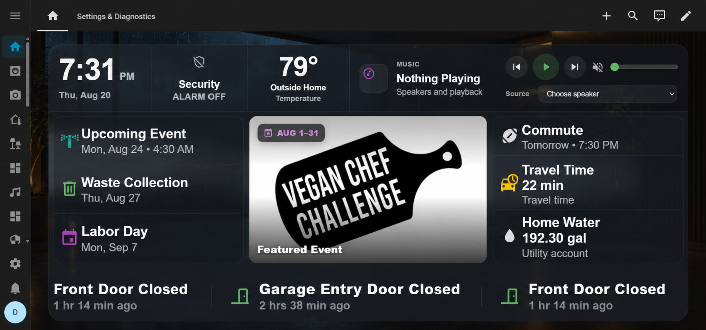
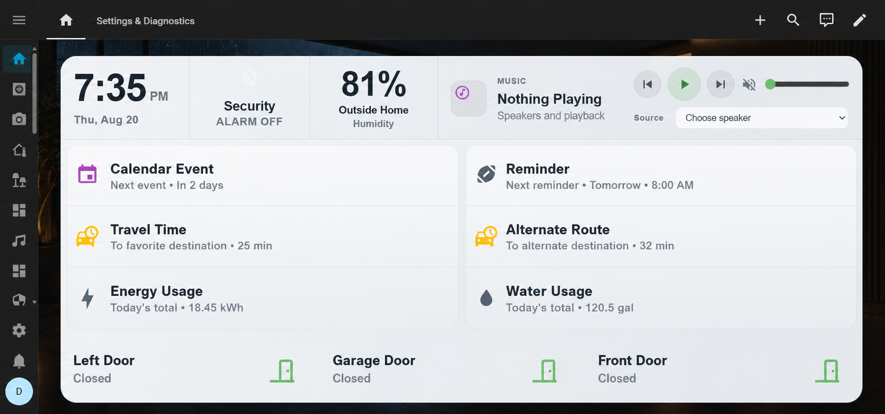
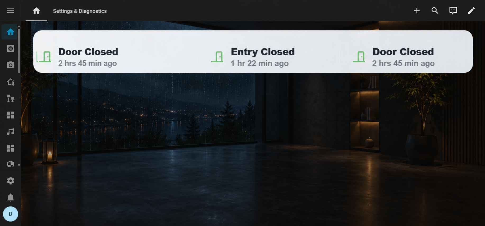

## Screenshots

### Full layout with Visual Center



### Natural-flow lanes



### Ticker-only



# Home Status

Home Status is a Home Assistant integration for wall tablets and dashboards. It takes selected information from Home Assistant and puts it into one custom card so you do not need a separate card for every sensor, device, event, or source.

It is intended for people who want to glance at a dashboard and quickly understand what is happening around the house, what recently happened, and what may be useful to know next.


## What it does

Home Status organizes information into four areas:

* **NOW** — active conditions and things currently happening.
* **RECENT** — recent household activity from Home Assistant Recorder.
* **AWARENESS** — useful information such as weather, calendars, traffic, utilities, presence, events, and news.
* **VISUAL** — images, cameras, event artwork, news media, and supported video.

The card can be used as a full wall-tablet display or in smaller dashboard layouts. It can also be reduced to a ticker-only view.

| Natural-flow lanes                                                            | Ticker-only layout                                         |
| ----------------------------------------------------------------------------- | ---------------------------------------------------------- |
|  |  |

## Who it is for

Home Status is mainly for Home Assistant users who have a lot of information available but do not want all of it taking up permanent dashboard space.

It works especially well on wall tablets, where space and readability matter, but it can be used on normal desktop and mobile dashboards as well.

You choose what Home Status is allowed to use. It can work with individual entities, whole devices, household sources, weather, calendars, traffic, utilities, news feeds, cameras, and supported video streams.

## Why it exists

A large Home Assistant setup can easily turn into a dashboard full of permanent cards.

Many of those cards are only useful occasionally. A washing machine matters while it is running. A door matters when it opens. Traffic matters when the drive is slower than normal. A calendar event matters when it is coming up. News or event artwork may be useful for a short time, but does not need permanent space.

Home Status was built to let that information appear when it is useful and move out of the way when it is not.

## Version 1

Version 1 is the supported Home Status architecture.

It publishes coordinated, revisioned data for the included card using separate Home Assistant sensors for current activity, recent activity, household information, weather, calendars, news, and visual media.

Recent activity uses Home Assistant Recorder rather than a separate Home Status history system.

Version 1 is the current product baseline. Pre-v1 compatibility and old runtime paths are not included.

## Install

### HACS

1. In HACS, add `https://github.com/biggiebytes/home-status` as an **Integration** repository.
2. Download **Home Status**.
3. Restart Home Assistant.
4. Go to **Settings → Devices & services → Add integration**.
5. Search for **Home Status** and complete setup.
6. Add the Home Status card from the dashboard card picker.

The frontend card is included with the integration. No separate Lovelace resource is required.

### Manual installation

Copy:

```text
custom_components/home_status
```

to:

```text
/config/custom_components/
```

Restart Home Assistant, then add **Home Status** from **Settings → Devices & services**.

## Basic card

```yaml
type: custom:home-status-card
entity: sensor.home_status
profile: auto
```

## Configuration

Use the integration's **Configure** flow to choose what Home Status should monitor.

You can select individual entities, whole devices, and supported information sources.

Depending on your Home Assistant setup, Home Status can display information from:

* household devices and sensors
* doors, windows, locks, alarms, and safety devices
* appliances
* household presence
* weather
* calendars and events
* traffic
* utilities
* RSS and Atom news feeds
* cameras
* direct HTTPS HLS video streams

The card also has presentation settings for lane behavior, theme, ticker, Visual Center, drawer, media, sizing, and display profile.

## Visual Center

Visual Center is an optional part of the card for media.

It can display:

* event artwork
* news images
* camera media
* configured images
* supported HLS video

When no visual content is active, the layout can use that space for the rest of the card.

## Network access

Home Status runs inside Home Assistant.

External requests are only made for sources that you configure and enable, such as RSS or Atom feeds and HTTPS HLS streams.

## Support

[Buy Me a Coffee](https://buymeacoffee.com/biggiebytes)

## License

Home Status is released under the [MIT License](LICENSE).

Bundled third-party assets retain their own license notices.
