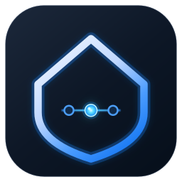
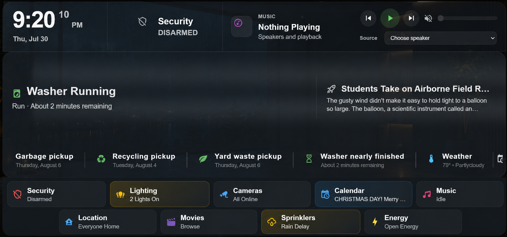
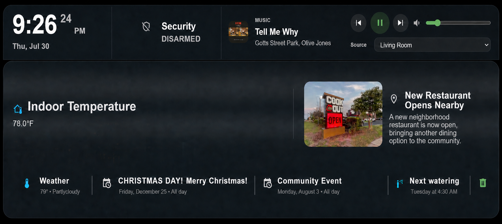
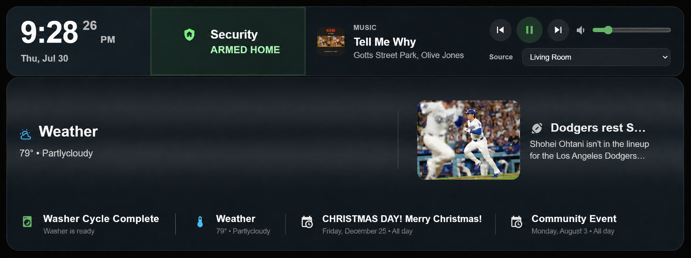
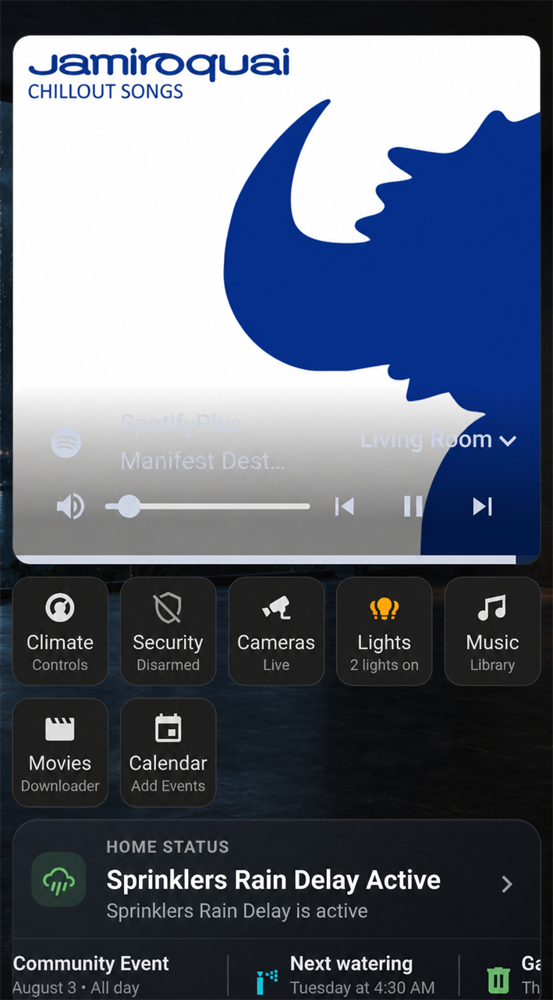

<p align="center">
  
</p>

<h1 align="center">Home Status</h1>

<p align="center"><strong>A notification and awareness platform for Home Assistant.</strong></p>

<p align="center">See what’s happening now, what just happened, and what you need to know next.</p>

Home Status turns the signals already in Home Assistant into a calm, readable
household view. Rather than asking everyone to scan a dashboard full of entity
cards, it brings together the information that deserves attention and presents
it in a form that makes sense at a glance.

It complements the dashboards you already use for control and exploration. Use
Home Status to understand the house; open your existing security, camera,
climate, music, or energy views when you want to act.



## The Home Status experience

### NOW — what is happening at home

Current household conditions stay visible when they matter: open doors and
windows, security states, active appliances, weather, climate measurements,
and other configured information. The aim is a human-readable answer to “what
needs my attention right now?” rather than a list of raw entity states.

### RECENT — what just happened

Home Status uses eligible, Recorder-backed transitions to retain useful recent
activity. A door that was just closed, a completed appliance cycle, and other
recently resolved events can stay available without being confused with a
current alert. Related door or window closures close together are grouped into
one clear event instead of overwhelming the ticker with duplicates.

### AWARENESS — what is coming up

The same card can surface contextual and upcoming information from the sources
you choose: calendar events, weather, waste collection, sprinklers and
watering, household presence, location, news, and other supported information
sources. Routing controls let you decide whether a kind of information belongs
in a main area, the bottom stream, both, or nowhere.

## One card, room to fit your dashboard

The large presentation in the screenshots is a dashboard-style **Notification
Center** mode. It is not a requirement to give Home Status an entire dashboard.

Home Status is size-responsive: choose the space available in your dashboard,
then adjust the card’s layout, width, body and row heights, ticker height, and
text sizing in its configuration. It adapts from a large, glanceable center to
smaller uses:

- a large dashboard-style Notification Center for a wall display;
- a smaller card alongside the controls already on an existing dashboard;
- a compact area for ongoing household awareness; or
- a minimal scrolling ticker when only a small amount of space is available.

The tablet, desktop, phone, and automatic profiles provide sensible starting
points, and the visual editor exposes the common presentation settings without
requiring YAML. The amount of dashboard space is your choice—Home Status
adapts to it.

## Screenshots

### Full Notification Center


### Visual Center



### Live household awareness



### A smaller dashboard placement



## Designed for useful signals

### Visual Center media

When valid visual content is available, Visual Center can temporarily take the
center of the card and return it to the normal information layout afterwards.
Supported configured visual sources include Home Assistant cameras and supplied
visual content such as feed images and supported video sources. Priority and
resumption settings determine which eligible visual is shown; nothing is shown
there unless a valid source is available.

### Appliances that say the useful part

Select whole washer, dryer, or dishwasher devices during setup. Home Status
recognizes supported operating-state entities and can show a running cycle,
remaining time or phase when provided, recognized faults, and a retained
completion event when the cycle ends. Supporting controls and telemetry are
deliberately ignored so they do not become misleading activity messages.

### Doors and windows without the noise

Openings can remain prominent while they are open, while recent closures can be
routed independently to RECENT. Closures close together are consolidated into
readable “Doors closed” or “Windows closed” updates, keeping the information
stream useful on a busy day.

### News and discovery, on your terms

Guided setup helps discover devices and supported information sources, while
leaving the final selection and presentation in your control. Optional generic
RSS and Atom feeds add headlines to Home Status; a feed-provided image may be
shown in Visual Center only for genuinely new articles. Optional direct HTTPS
HLS Live News sources rotate as Visual Center samples and do not create ticker
or history events. Home Status does not scrape or adapt publisher websites.

## Installation

Home Status installs as one HACS integration. The integration, bundled card,
visual editor, and local frontend assets are delivered together.

### HACS

1. In HACS, add `https://github.com/biggiebytes/home-status` as an
   **Integration** repository.
2. Download **Home Status** and restart Home Assistant.
3. Open **Settings → Devices & services → Add integration**.
4. Search for **Home Status** and complete the guided setup.
5. Add **Home Status** from the dashboard card picker.

The bundled card registers automatically. No separate dashboard resource or
copy to `/config/www` is required.

### Manual installation

Copy `custom_components/home_status` to `/config/custom_components/`, restart
Home Assistant, then add **Home Status** from **Settings → Devices & services**.
The bundled card still registers automatically.

After setup, the card can be added in the editor, or with a minimal
configuration:

```yaml
type: custom:home-status-card
entity: sensor.home_status
profile: auto
```

Choose `tablet`, `desktop`, or `phone` as a starting profile when appropriate;
the visual editor and integration configuration provide the rest of the
presentation controls.

## Configuration

Configure Home Status through **Settings → Devices & services → Home Status →
Configure**. Setup and reconfiguration cover the monitored devices,
information sources, household presence, news and visual sources, presentation
and routing, navigation destinations, timing and retained recent activity.

## Privacy and data

Home Status runs inside Home Assistant and publishes only the bounded
presentation data needed by the card through `sensor.home_status`. The payload
is kept below Home Assistant Recorder’s attribute limit to avoid unnecessary
database churn. This repository contains no household configuration, entity
history, databases, credentials, tokens, or secrets.

Optional RSS/Atom and Live News sources make outbound requests only when you
explicitly enable them.

## Technical notes

This README describes the validated **0.9.2** behavior. For contributors, run
the release checks with:

```sh
python -m pytest -q
npm install
npm run test:card
```

## Support

If Home Status has made your Home Assistant setup more useful, you can support
its development at [Buy Me a Coffee](https://buymeacoffee.com/biggiebytes).

## License

Home Status and the Beacon branding are released under the [MIT License](LICENSE).
Bundled third-party assets retain their license notices.
